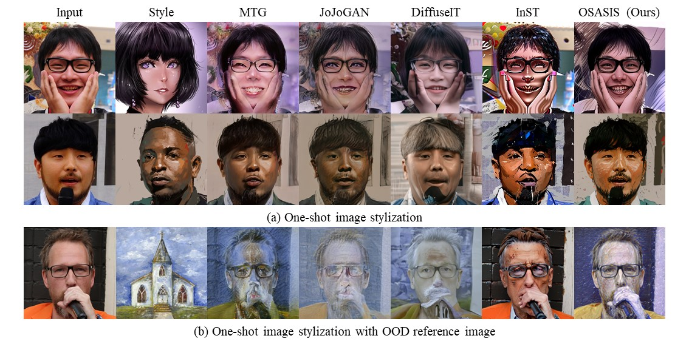

# [CVPR 2024] One-Shot Structure-Aware Stylized Image Synthesis

[](https://arxiv.org/abs/2402.17275)

> **One-Shot Structure-Aware Stylized Image Synthesis**<br>
> Hansam Cho, Jonghyun Lee, Seunggyu Chang, Yonghyun Jeong<br>
> 
>**Abstract**: <br>
While GAN-based models have been successful in image stylization tasks, they often struggle with structure preservation while stylizing a wide range of input images. Recently, diffusion models have been adopted for image stylization but still lack the capability to maintain the original quality of input images. Building on this, we propose OSASIS: a novel one-shot stylization method that is robust in structure preservation. We show that OSASIS is able to effectively disentangle the semantics from the structure of an image, allowing it to control the level of content and style implemented to a given input. We apply OSASIS to various experimental settings, including stylization with out-of-domain reference images and stylization with text-driven manipulation. Results show that OSASIS outperforms other stylization methods, especially for input images that were rarely encountered during training, providing a promising solution to stylization via diffusion models.

## Description
Official implementation of One-Shot Structure-Aware Stylized Image Synthesis



## Setup
```
conda env create -f environment.yaml
conda activate osasis
```

## Prepare Training
1. Download DDPM with [P2-weighting](https://github.com/jychoi118/P2-weighting) trained on FFHQ ([ffhq_p2.pt](https://drive.google.com/file/d/14ACthNkradJWBAL0th6z0UguzR6QjFKH/view?usp=drive_link)) and put model checkpoint in `P2_weighting/models`
```
OSASIS
|--P2_weighting
|  |--models
|  |  |--ffhq_p2.pt
```

2. Generate style images in domain A (photorealistic domain)

```
DEVICE=0

SAMPLE_FLAGS="--attention_resolutions 16 --class_cond False --class_cond False --diffusion_steps 1000 --dropout 0.0 \
    --image_size 256 --learn_sigma True --noise_schedule linear --num_channels 128 --num_res_blocks 1 --num_head_channels 64 \
    --resblock_updown True --use_fp16 False --use_scale_shift_norm True --timestep_respacing 50"

CUDA_VISIBLE_DEVICES=${DEVICE} \
python gen_style_domA.py ${SAMPLE_FLAGS} \
    --model_path P2_weighting/models/ffhq_p2.pt \
    --input_dir imgs_style_domB \
    --sample_dir imgs_style_domA \
    --img_name img1.png \
    --n 1 \
    --t_start_ratio 0.5 \
    --seed 1 \

```
`input_dir`: directory of style images in domain B (stylized domain) <br>
`sample_dir`: saving directory of style images in domain A (photorealistic domain) <br>
`img_name`: name of style image <br>
`n`: number of sampling images to generate style image in domain A<br>
`t_srtart_ratio`: noising level of image ($t_0$) 


## Training
1. Download [DiffAE](https://github.com/phizaz/diffae) trained on FFHQ( [ffhq256_autoenc](https://vistec-my.sharepoint.com/personal/nattanatc_pro_vistec_ac_th/_layouts/15/onedrive.aspx?id=%2Fpersonal%2Fnattanatc%5Fpro%5Fvistec%5Fac%5Fth%2FDocuments%2Fdiffae%2Dpublic%2Fcheckpoints%2Fffhq256%5Fautoenc&ga=1), [ffhq256_autoenc_latent](https://vistec-my.sharepoint.com/personal/nattanatc_pro_vistec_ac_th/_layouts/15/onedrive.aspx?id=%2Fpersonal%2Fnattanatc%5Fpro%5Fvistec%5Fac%5Fth%2FDocuments%2Fdiffae%2Dpublic%2Fcheckpoints%2Fffhq256%5Fautoenc%5Flatent&ga=1) ) and put model checkpoints in `diffae/checkpoints`
```
OSASIS
|--diffae
|  |--checkpoints
|  |  |--ffhq256_autoenc
|  |  |  |--last.ckpt
|  |  |  |--latent.pkl
|  |  |--ffhq256_autoenc_latent
|  |  |  |--last.ckpt
```


2. Train the model using the following scripts, which necessitate 34GB of VRAM for a batch size of 8. The process takes in approximately 30 minutes on a single A100 GPU.

```
DEVICE=0

CUDA_VISIBLE_DEVICES=${DEVICE} \
python train_diffaeB.py \
    --style_domA_dir imgs_style_domA \
    --style_domB_dir imgs_style_domB \
    --ref_img img1.png \
    --work_dir exp/img1 \
    --n_iter 200 \
    --ckpt_freq 200 \
    --batch_size 8 \
    --map_net \
    --map_time \
    --lambda_map 0.1 \
    --train
```
`style_domA_dir`: directory of style images in domain A (photorealistic domain) <br>
`style_domB_dir`: directory of style images in domain B (stylized domain) <br>
`ref_img`: name of style image <br>
`work_dir`: working directory <br>
`n_iter`: number of iteration


## Testing
Generate stylized image with following scripts:
```
DEVICE=0

CUDA_VISIBLE_DEVICES=${DEVICE} \
python eval_diffaeB.py \
    --style_domB_dir imgs_style_domB \
    --infer_dir imgs_input_domA \
    --ref_img img1.png \
    --work_dir exp/img1 \
    --map_net \
    --map_time \
    --lambda_map 0.1
```
`style_domB_dir`: directory of style images in domain B (stylized domain) <br>
`infer_dir`: directory of input images in domain A (photorealistic domain) <br>
`ref_img`: name of style image <br>
`work_dir`: working directory

## TODO
- [ ] Upload pretrained models

## Acknowledgements
This repository is built upon [P2-weighting](https://github.com/jychoi118/P2-weighting), [DiffAE](https://github.com/phizaz/diffae), and [MindTheGap](https://github.com/ZPdesu/MindTheGap)

## Citation
```bibtex
@article{cho2024one,
  title={One-Shot Structure-Aware Stylized Image Synthesis},
  author={Cho, Hansam and Lee, Jonghyun and Chang, Seunggyu and Jeong, Yonghyun},
  journal={arXiv preprint arXiv:2402.17275},
  year={2024}
}
```